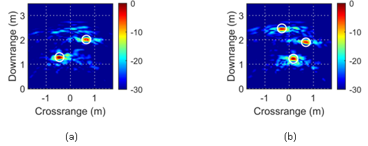

# Sparse Low Rank Autoencoder
 Clutter Removal in Through the Wall Radar Imaging using Sparse Autoencoder with Low Rank Projection

## Description
<p align="justify"> 
Through-the-wall radar imaging is a sensing technology that can be employed by first responders to see through opaque barriers during search-and-rescue missions, or it can be deployed by law enforcement and military personnel to maintain situational awareness during tactical operations. However, strong reflections from the front wall and other obstacles pose significant challenges in detecting stationary targets. This paper introduces a learning-based approach to mitigate the effects of the wall and background clutter. A sparse autoencoder with low-rank projection has been developed to reduce wall clutter and enhance the target signal. The weights of the proposed autoencoder are determined by solving an augmented Lagrangian multiplier optimization problem, and the regularization parameters are optimized using Bayesian optimization techniques.
</p>

## Experimental Setup
<p align="justify"> 
In the Radar Imaging Laboratory of the Centre for Signal and Information Processing at the University of Wollongong, Australia, a stepped-frequency radar system was utilized for data collection. The radar system comprises a network analyzer that generates a stepped-frequency waveform, covering a frequency band from 1 GHz to 4 GHz with a step size of 7.5 MHz. It also includes a scanner designed to synthesize a linear array aperture with a length of 1.5 m and 41 elements. The radar system was positioned inside a room without an RF absorber, and a hollow wooden partition with a thickness of 0.08 m served as a wall.
</p>
<br />
<p align="justify"> 
For training, the wall was positioned at four different standoff distances: 0.5 m, 1.0 m, 1.2 m, and 1.5 m. At each standoff distance, the horn antenna was operated at various heights, ranging from 0.5 m to 1 m. For each combination of standoff distance and antenna height, a set of 41 radar signals was acquired. Additionally, several Through-the-Wall Radar Imaging (TWRI) scenes, containing a varying number of targets from one to four dihedrals, were scanned.
</p>
<br />


**Fig. 1.** Stepped-frequency radar system for data collection and geometry maps of TWRI.

## Results
<p align="justify">
The proposed sparse autoencoder with low-rank projection was trained on a dataset comprising 7,298 stepped-frequency radar signals. For evaluation, two test sets, each containing 41 radar signals, were recorded. The first test set was acquired from a scene with two dihedrals positioned behind a wall, while the second test set originated from a scene that included three dihedrals. Figure 2 displays the beamformed images generated using the raw radar data, and Figure 3 presents the images reconstructed from the radar signals after denoising with the proposed method.
</p>


<br /> 
**Fig. 2.** Beamformed images of (a) two-target scene and (b) three-target scene using the collected raw stepped-frequency data.


<br /> 
**Fig. 3.** Beamformed images of (a) two-target scene and (b) three-target scene using signals denoised with the proposed method.


## Citation
If you find this work or code is helpful for your research, please cite:
```
@ARTICLE{,
  author={F. H. C. Tivive and A. Bouzerdoum},
  journal={IEEE Transactions of on Geoscience and Remote Sensing}, 
  title={Clutter Removal in Through the Wall Radar Imaging using Sparse Autoencoder with Low Rank Projection}, 
  year={2021},
  volume={59},
  number={2},
  pages={1118-1129},
  doi={10.1109/TGRS.2020.3004331}}
  ```
## Reference
F. H. C. Tivive and A Bouzerdoum, *Clutter removal in through the wall radar imaging using sparse autoencoder with low rank projection,* IEEE Transactions of on Geoscience and Remote Sensing, vol. 59, no. 2, pp. 1118-1129, 2021.


